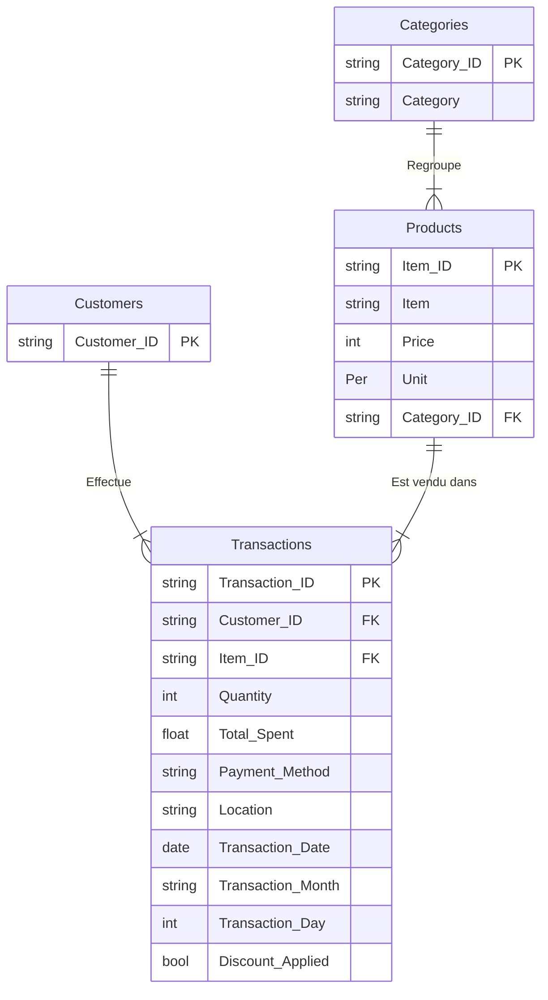

# Retail Store Sales Analysis - Documentation

## 👥 Présentation de l'équipe
- Équipe : Flawless
- Membres : Fatima, Amine, Souad, Safia
- Taches : voir Trello

## 📅 Documentation - Day 1 (10/11/2025)

### Step 1: Data Loading

- **File Name:** `retail store sales.csv`
- **Import Method:** Loaded into Power BI using Power Query.
- **Settings:** Encoding `UTF-8`, Delimiter `Comma`.

### 🏗️ Initial Structure
- **Rows:** 12,575
- **Columns:** 11

### 🧐 Initial Data Quality Observations

| Column Name | Data Type | Validity | Notes / Missing Values |
| :--- | :--- | :--- | :--- |
| **Transaction ID** | Text | 100% | All values valid and unique. |
| **Customer ID** | Text | 100% | All values valid. |
| **Category** | Text | 100% | All values valid (8 distinct values). |
| **Item** | Text | 90% | **1,213** empty rows. |
| **Price Per Unit** | Number | 95% | **609** empty rows. |
| **Quantity** | Int | 95% | **604** empty rows. |
| **Total Spent** | Number | 95% | **604** empty rows. |
| **Payment Method**| Text | 100% | All values valid. |
| **Location** | Text | 100% | All values valid. |
| **Transaction Date**| Date | 100% | All values valid. |
| **Discount Applied**| Logical | 67% | **4,199** empty rows. |

---

## 🚀 Documentation - Jour 2 : Identification des Hypothèses et Analyse des Données

### 1. Analyse de l'intégrité des données

- **Transaction ID :**
  - Nous avons identifié **12 575** identifiants de transaction distincts.
  - ✅ **Conclusion :** Absence de doublons, chaque transaction est unique.

- **Customer ID et Catégories de produits :**
  - L'analyse révèle **25** identifiants clients uniques et **8** catégories de produits.
  - *Théorie :* La combinaison de ces deux dimensions devrait produire 200 items (25 × 8).
  - *Observation :* Nous observons **201** items distincts.

- **Item (Nom du produit) :**
  - L'écart ci-dessus s'explique par la présence de valeurs manquantes (**10%** des données) dans la colonne `Item`.
  - 🛠 **Décision :** L'identification précise du nom du produit n'étant pas essentielle (la catégorie suffit), nous remplaçons les valeurs `null` par **"Non spécifié"**.

### 2. Traitement des valeurs manquantes dans les colonnes financières

**Observation :**
Les colonnes `Price`, `Quantity` et `Total Spent` présentent chacune **5%** de valeurs manquantes.

**Relation Mathématique :**
> **Total Spent = Price × Quantity**

**Stratégie de remplissage logique :**

| Cas de figure | Variables Disponibles | Formule Appliquée |
| :--- | :--- | :--- |
| **Cas 1 : Total manquant** | Price, Quantity | `Total Spent = Price × Quantity` |
| **Cas 2 : Price manquant** | Total Spent, Quantity | `Price = Total Spent ÷ Quantity` |
| **Cas 3 : Quantity manquante** | Total Spent, Price | `Quantity = Total Spent ÷ Price` |
| **Cas 4 : 2+ variables manquantes** | Insuffisantes | 🗑 **Suppression de la ligne** (Impossibilité de reconstituer l'info de manière fiable). |

### 3. Analyse des variables catégorielles

- **Payment Method (Méthode de paiement) :**
  - **3 modalités :** Cash (Espèces), Card (Carte bancaire), Digital Wallet (Portefeuille numérique).
  - ✅ Aucune valeur manquante.

- **Location (Point de vente) :**
  - **2 modalités :** Online (En ligne), In-Store (En magasin).
  - ✅ Données complètes.

- **Transaction Date :**
  - ✅ Format de date cohérent et uniforme. Aucune anomalie.

- **Discount (Réduction appliquée) :**
  - **3 valeurs :** `True` (Oui), `False` (Non), et `null`.
  - *Analyse :* Les valeurs `null` indiquent que l'info n'a pas été enregistrée.
  - 🛠 **Décision :** Remplacement des `null` par **"Unknown"**.

## 🚀 Documentation - Jour 3 : Creation des tables de dimension

### 4️⃣ Modélisation du modèle de données

### 🏗️ Architecture : Schéma en Flocon (Snowflake Schema)

Nous avons structuré les données selon une architecture normalisée pour garantir l'intégrité des dimensions.
Le modèle s'articule autour d'une table de faits centrale reliée à des dimensions, dont l'une est hiérarchisée (`Categories` ➔ `Products` ➔ `Transactions`).

### 📂 Dictionnaire des Tables

#### 1. Table de Faits : `Transactions`
Contient l'ensemble des événements de vente.
* **Clés Primaires/Étrangères :** `Transaction ID`, `Customer ID` (FK), `Item ID` (FK).
* **Summarization :** `Quantity`, `Total Spent`.
* **Métriques (Mesures) :**  `Transaction Date`.

#### 2. Tables de Dimension
Ces tables servent d'axes d'analyse.

* **`Customers`**
    * *Contenu :* Référentiel unique des clients.
    * *Relation :* **1 ➔ * (Plusieurs)** vers `Transactions` via `Customer ID`.

* **`Products`** (4 colonnes)
    * *Contenu :* Détails des articles vendus.
    * *Relation :* **1 ➔ * (Plusieurs)** vers `Transactions` via `Item ID`.
    * *Rôle :* Table intermédiaire portant la clé étrangère vers les catégories.

* **`Categories`**
    * *Contenu :* Référentiel des catégories de produits.
    * *Relation :* **1 ➔ * (Plusieurs)** vers `Products` via la colonne `Category_ID`.

---

### 🗺️ Diagramme Relationnel (ERD)

## 🚀 Documentation - Jour 4 : Conception et Documentation du Tableau de Bord Power BI : Mesures DAX, KPI et Vues Métier

### 5️⃣ & 6️⃣ Mesures DAX, KPI et Vues Métier
#### Page 1 :
| KPI / Visualisation | Q a Repondre | DAX / Source |
| :--- | :--- | :--- |
| **CA par Année et Mois** (Line Chart) | Comment évolue notre chiffre d'affaires mois par mois au fil du temps ? | *Standard Aggregation / Power Query* |
| **CA par Location** (Donut Chart) | Où nos clients achètent-ils principalement ? | *Standard Aggregation / Power Query* |
| **CA par Année** (Bar Chart - Right) | Comment notre chiffre d'affaires annuel évolue-t-il ? | *Standard Aggregation / Power Query* |
| **CA par Category** (Bar Chart - Left) | Quelles catégories de produits génèrent le plus de revenus ? | *Standard Aggregation / Power Query* |
| **CA par Payment Method** (Pie Chart) | Comment nos clients paient-ils leurs achats ? | *Standard Aggregation / Power Query* |
| **Produit Plus Vendu** (Table) | Quel est le produit le plus vendu (best-seller) dans chaque catégorie ? | `Produit Plus Vendu = VAR TopProduct = MAXX( TOPN( 1, VALUES(Products[Item]), COUNTROWS(Transactions), DESC ), Products[Item] ) RETURN TopProduct` |
| **CA Total** (Card) | C'est quoi le total des ventes ? | `CA = SUM(Transactions[Total Spent])` |
| **Panier Moyen** (Card) | Quel est le montant moyen d'achat dans chaque panier ? | `Panier Moyen = DIVIDE( [CA], DISTINCTCOUNT(Transactions[Transaction ID]), 0 )` |
| **% Ventes Online** (Card) | Quelle est la part du chiffre d'affaires réalisée en ligne ? | `% Ventes Online = DIVIDE( CALCULATE([CA], Transactions[Location] = "Online"), CALCULATE([CA], ALL(Transactions[Location])), 0 )` |
| **% Ventes In-Store** (Card) | Quelle est la part du chiffre d'affaires réalisée en magasin ? | `% Ventes In-Store = DIVIDE( CALCULATE([CA], Transactions[Location] = "In-Store"), CALCULATE([CA], ALL(Transactions[Location])), 0 )` |

#### Page 2 : 
| KPI | Question à Répondre | DAX or M |
| :--- | :--- | :--- |
| **NB total des clients** | Combien de clients avons-nous au total ? | `NbUnique Customers = COUNTROWS(Customers)`|
| **Premier transaction** | Est-ce que nous avons de nouveaux clients ? | `Date 1ère Transaction = CALCULATE( MIN(Transactions[Transaction Date]), FILTER(Transactions, Transactions[Customer ID] = Customers[Customer ID]) )` |
| **Date dernier transaction** | Nos clients sont-ils fidèles ? | `Date dernier transaction = CALCULATE( MAX(Transactions[Transaction Date]), FILTER(Transactions, Transactions[Customer ID] = Customers[Customer ID]))` |
| **NB des categories consommés par client** | Quelles sont les catégories les plus recherchées par nos clients ? | `Nb Catégories Consommées = CALCULATE( DISTINCTCOUNT(Transactions[Category]), RELATEDTABLE(Transactions) )` |
| **Avg Total Spent** | Quel est le montant moyen dépensé par transaction ? | `CALCULATE( AVERAGE(Transactions[Total Spent]), FILTER(Transactions, Transactions[Customer ID] = Customers[Customer ID]) )` |
| **% Achats avec Promotion** | Les clients sont-ils plus intéressés par les promotions ? | `VAR TotalConnus = CALCULATE(COUNTROWS(Transactions), Transactions[Discount Applied] IN { "true", "false" }) VAR TotalPromo = CALCULATE(COUNTROWS(Transactions), Transactions[Discount Applied] = "true") RETURN DIVIDE(TotalPromo, TotalConnus)` |
| **Avg Days Between** | À quelle fréquence nos clients reviennent-ils ? | *Calculated in Power Query (M)* |
| **Nb des Transactions par categorie** | Quelle est la catégorie dominante ? | `CALCULATE(COUNTROWS(Transactions),FILTER(Transactions,Transactions[Category]=Categories[Category]))` |
| **Discount at First Transaction** | Combien de clients ont été attirés par une remise (Discount) lors de leur premier achat ? | `VAR First_Date = Customers[Date 1ère Transaction] VAR HasTrue = COUNTROWS(FILTER(Transactions, Transactions[Customer ID] = Customers[Customer ID] && Transactions[Transaction Date] = First_Date && Transactions[Discount Applied] = "true")) VAR HasFalse = COUNTROWS(FILTER(Transactions, Transactions[Customer ID] = Customers[Customer ID] && Transactions[Transaction Date] = First_Date && Transactions[Discount Applied] = "false")) RETURN IF(HasTrue > 0, "true", IF(HasFalse > 0, "false", "unknown"))`|

